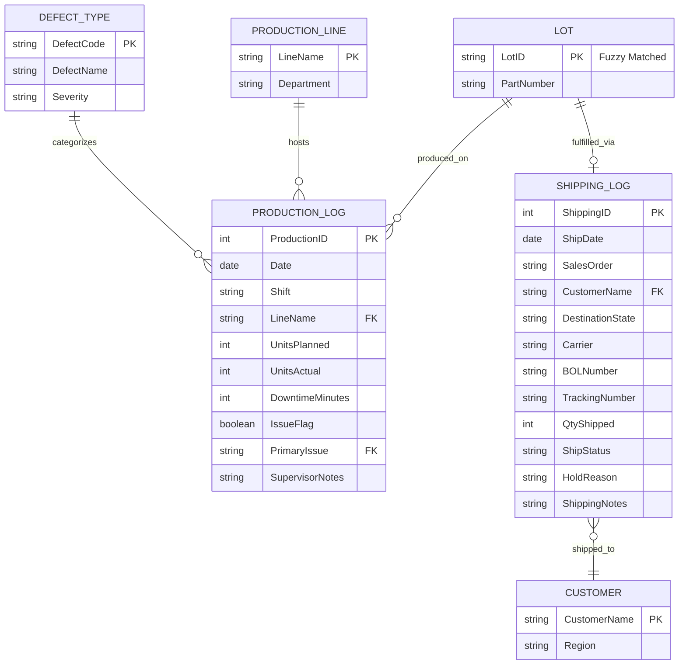

### Merged Data Entities & Attributes

#### 1. Lot
The central anchor record that normalizes inconsistent IDs across different team logs.
| Attribute | Type | Notes |
| :--- | :--- | :--- |
| **LotID** (PK) | String | Primary Key (e.g., "LOT-20260112-001"); handles fuzzy matching logic. |
| **PartNumber** | String | The specific SKU or part being manufactured. |

#### 2. ProductionLog
The activity record for the manufacturing floor.
| Attribute | Type | Notes |
| :--- | :--- | :--- |
| **ProductionID** (PK) | Integer | Unique surrogate key for each log entry. |
| **Date** | Date | Normalizes MM/DD/YY and YYYY-MM-DD formats. |
| **Shift** | String | Day, Swing, or Night shift designation. |
| **LineName** (FK) | String | Reference to the ProductionLine table. |
| **UnitsPlanned** | Integer | Targeted production volume. |
| **UnitsActual** | Integer | Actual units produced. |
| **DowntimeMinutes**| Integer | Total minutes of line stoppage. |
| **IssueFlag** | Boolean | Binary flag for quick filtering of problematic runs. |
| **PrimaryIssue** (FK)| String | Link to DefectType for categorical analysis. |
| **SupervisorNotes** | Text | Qualitative data for deep-dive investigation. |

#### 3. ShippingLog
The record of fulfillment and logistics.
| Attribute | Type | Notes |
| :--- | :--- | :--- |
| **ShippingID** (PK) | Integer | Unique surrogate key for each shipment entry. |
| **LotID** (FK) | String | Link back to the Lot table to track ship status. |
| **ShipDate** | Date | Date the batch left the facility. |
| **SalesOrder** | String | External reference number for the buyer's order. |
| **CustomerName** (FK)| String | Reference to the Customer table. |
| **DestinationState**| String | State code for geographic trend reporting. |
| **Carrier** | String | Logistics provider (e.g., UPS, XPO, FedEx). |
| **BOLNumber** | String | Bill of Lading for shipping verification. |
| **TrackingNumber** | String | Tracking or PRO number for the shipment. |
| **QtyShipped** | Integer | The physical count of units shipped. |
| **ShipStatus** | String | Current status: Shipped, On Hold, or Partial. |
| **HoldReason** | String | Specific reason if a lot is blocked from shipping. |
| **ShippingNotes** | Text | General logistics comments. |

#### 4. DefectType
Used to standardize "Primary Issue" names for trending reports.
| Attribute | Type | Notes |
| :--- | :--- | :--- |
| **DefectCode** (PK) | String | Unique identifier for a type of issue. |
| **DefectName** | String | Human-readable name (e.g., "Changeover Delay"). |
| **Severity** | String | Critical, Major, or Minor. |

#### 5. ProductionLine
Normalized asset table to track line-specific performance.
| Attribute | Type | Notes |
| :--- | :--- | :--- |
| **LineName** (PK) | String | Unique identifier (e.g., "Line 1", "Line 4"). |
| **Department** | String | Functional area of the facility. |

#### 6. Customer
Destination records to identify impact on specific clients.
| Attribute | Type | Notes |
| :--- | :--- | :--- |
| **CustomerName** (PK)| String | Unique identifier for the client. |
| **Region** | String | Sales or logistics territory. |

---

## ERD

